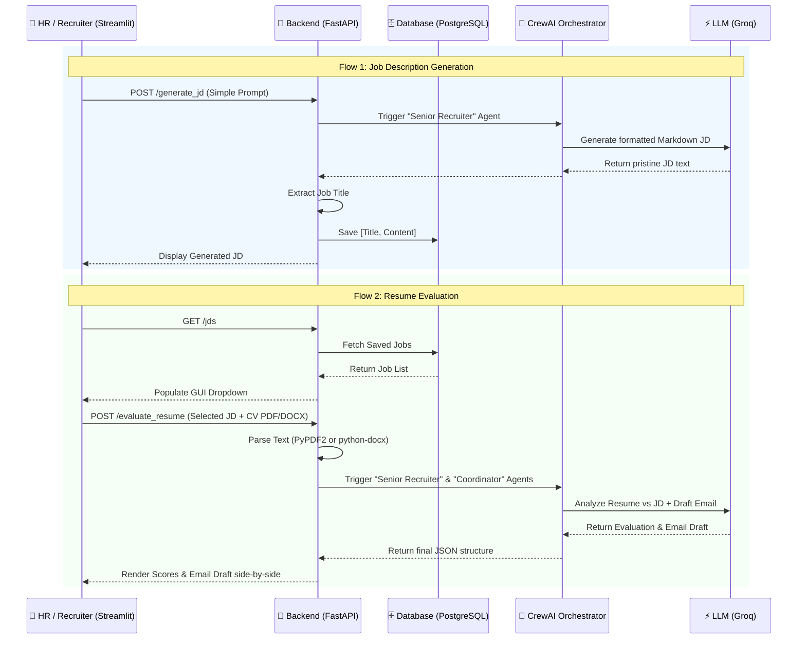

# 🏗️ HireNova Architecture 

> **A high-level overview of the HireNova multi-agent ecosystem and data flow.**

This document outlines how the frontend, backend, database, and AI agents interact to automate the recruitment pipeline from Job Creation to Candidate Evaluation.

---

## 🌊 Application Flow Diagram

---

## 🏛️ Component Breakdown

The system is separated into three distinct layers to ensure modularity and scalability:

### 1. The Presentation Layer (`frontend/app.py`)
Built entirely in **Streamlit**, this layer provides a highly responsive UI. It directly communicates with the REST API.
* **Sidebar:** Fetches and displays all historically generated Job Descriptions (`GET /jds`) from the backend, providing persistent context. It also handles deletion requests.
* **Step 1 View:** A clean input area for prompt-based Job Description generation.
* **Step 2 View:** A dual-upload interface that pairs a selected database JD with a candidate's uploaded `.pdf` or `.docx` resume. Outputs the final analysis side-by-side using custom HTML/CSS cards.

### 2. The Logic & API Layer (`backend/main.py` & `backend/agents.py`)
Built in **FastAPI**, this is the core orchestrator of the application.
* **File Parsing:** Natively handles the extraction of raw text streams from incoming PDF and DOCX files.
* **Regex Extraction:** Intelligently parses Markdown outputs from the LLM to locate and extract the "Job Title" dynamically.
* **Agent Orchestration (`agents.py`):** Uses **CrewAI** to define distinct personas (e.g., "Senior Executive Recruiter") and goals. It maps incoming API inputs into structured Tasks and delegates them to the Groq LLM.

### 3. The Persistence Layer (`backend/database.py` & `backend/models.py`)
Manages the application's long-term memory.
* **SQLAlchemy ORM:** Maps Python objects to database rows.
* **NeonDB:** A serverless PostgreSQL database hosted in the cloud. It securely stores every generated Job Description (`id`, `title`, `content`), allowing the system to scale beyond simple in-memory session states.
